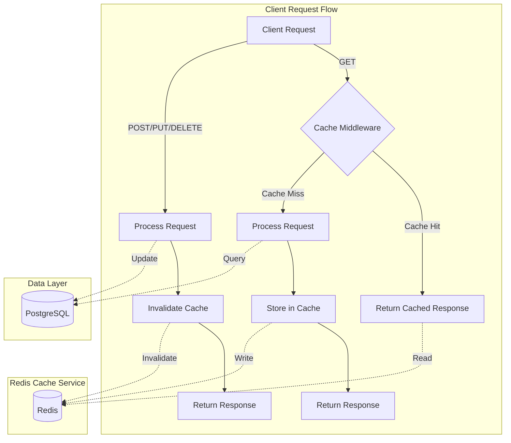

# Redis Caching Implementation

This document provides an overview of the Redis caching implementation in the LOG430 application.

## Overview

Redis is used to cache API responses from critical endpoints to reduce database load and improve response times. This implementation follows a simple pattern:

1. **Read-through caching**: GET requests check the cache first before hitting the database
2. **Write-through invalidation**: Write operations (POST/PUT/DELETE) invalidate relevant cached data

## Architecture

The caching system consists of the following components:

1. **Redis Service**: A module that handles Redis connection and provides core caching operations
2. **Caching Middleware**: Express middleware that can be applied to any route to cache its response
3. **Cache Invalidation Helper**: Utility to invalidate caches when data is modified

### Caching Flow

The following diagram illustrates the caching flow for both read and write operations:



## Cache Keys

Cache keys are created using the following format:
- `api:[request_url]`: Caches API responses based on the full URL (including query parameters)

## Cached Endpoints

The following endpoints are cached (TTL: 5 minutes):

### Products
- `GET /api/v1/products`: List of products
- `GET /api/v1/products/:id`: Product details

### Stores
- `GET /api/v1/stores`: List of stores
- `GET /api/v1/stores/:id`: Store details
- `GET /api/v1/stores/:id/stock`: Store inventory

### Stock
- `GET /api/v1/stock/product/:productId`: Stock levels for a product
- `GET /api/v1/stock/store/:storeId`: Stock levels in a store

### Sales
- `GET /api/v1/sales`: List of sales
- `GET /api/v1/sales/client/:clientId`: Sales for a client
- `GET /api/v1/sales/store/:storeId`: Sales for a store

## Cache Invalidation

When data is modified, related caches are automatically invalidated:

- **Product changes**: Invalidates product and stock caches
- **Store changes**: Invalidates store and stock caches
- **Stock changes**: Invalidates product, store, and stock caches
- **Sales changes**: Invalidates sales and stock caches

## Configuration

Redis connection settings can be configured through environment variables:

- `REDIS_HOST`: Redis server hostname (default: localhost)
- `REDIS_PORT`: Redis server port (default: 6379)
- `REDIS_PASSWORD`: Redis server password (default: none)

## Deployment

### Docker Compose

The Redis service is configured in `docker-compose.yml` as follows:

```yaml
redis:
  image: redis:7-alpine
  container_name: log430-redis
  ports:
    - "6379:6379"
  volumes:
    - redis-data:/data
  restart: always
  command: redis-server --appendonly yes
```

### Kubernetes

For Kubernetes deployment, Redis is configured in `k8s/redis.yaml`.

## Performance Benefits

The caching implementation provides several benefits:

1. **Reduced database load**: Frequent read queries hit the cache instead of the database
2. **Improved response times**: Cached responses are typically 3-10x faster than database queries
3. **Better scalability**: The application can handle more concurrent users with the same resources
4. **Resilience**: If the database temporarily slows down, cached data can still be served quickly

## Testing

Unit tests for the caching mechanism are available in `server/tests/cache.test.js`.

## Monitoring

Redis performance can be monitored using:

- Redis CLI commands: `redis-cli info stats`
- Prometheus Redis exporter (future enhancement)
- Grafana dashboards for Redis metrics (future enhancement) 