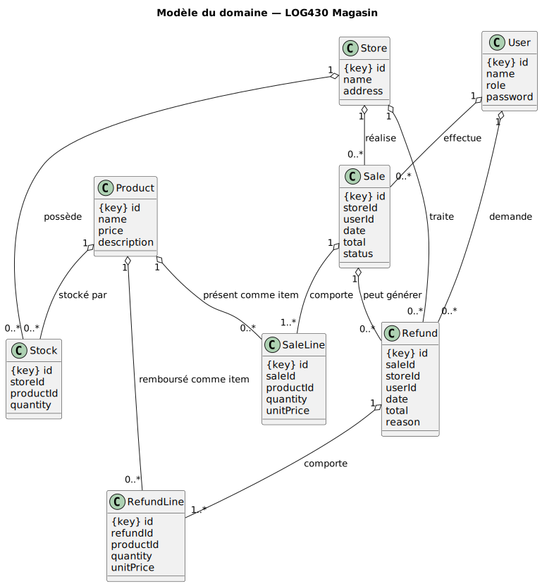

# Rapport d'architecture – LOG430 Lab 4

## Liens vers les dépôts Github

- Lab0 : [https://github.com/Minh-Khoi-Le/log430-lab0.git](https://github.com/Minh-Khoi-Le/log430-lab0.git)
- Lab1 : [https://github.com/Minh-Khoi-Le/log430-lab1-cli.git](https://github.com/Minh-Khoi-Le/log430-lab1-cli.git)
- Lab2 : [https://github.com/Minh-Khoi-Le/log430-lab2.git](https://github.com/Minh-Khoi-Le/log430-lab2.git)
- Lab3 : [https://github.com/Minh-Khoi-Le/log430-lab2/releases/tag/lab3](https://github.com/Minh-Khoi-Le/log430-lab2/releases/tag/lab3)
- Lab4 : [https://github.com/Minh-Khoi-Le/log430-lab4.git](https://github.com/Minh-Khoi-Le/log430-lab4.git)

---

## 1. Introduction et objectifs

### Finalité du projet

Système distribué haute performance de gestion pour une chaîne de magasins, comprenant la gestion des stocks, ventes, remboursements multi-magasin, mise en cache avancée (Redis), monitoring (Prometheus/Grafana) et déploiement Kubernetes pour la scalabilité.

### Enjeux principaux

Performance, modularité, évolutivité, maintenabilité, interface moderne, déploiement conteneurisé avec orchestration, monitoring et mise en cache distribuée.

### Objectifs de qualité

- **Performance** : Temps de réponse < 200ms grâce au cache Redis
- **Scalabilité** : Support de charge élevée via Kubernetes et load balancing
- **Observabilité** : Monitoring complet avec métriques Prometheus
- **Fiabilité** : Gestion des erreurs et des pannes avec retry patterns

---

## 2. Contraintes et environnement technique

### Stack technologique actuelle

- **Frontend** : React 18 + Vite, Context API pour la gestion d'état
- **Backend** : Node.js/Express avec architecture en couches (Controllers → Services → DAO)
- **Base de données** : PostgreSQL avec Prisma ORM
- **Cache** : Redis pour mise en cache des API et sessions
- **Monitoring** : Prometheus + Grafana pour métriques et dashboards
- **Déploiement** : Kubernetes avec Docker containers
- **Tests de charge** : K6 pour tests de performance

### Contraintes techniques

- Architecture microservices-ready avec séparation claire des responsabilités
- API REST standardisée avec middleware de validation
- Authentification JWT et gestion des rôles
- Cache distribué avec stratégies TTL différenciées
- Load balancing et haute disponibilité
- Monitoring et observabilité complète

---

## 3. Vue contextuelle et portée du système

### Acteurs du système

- **Gestionnaire de la maison mère** : Gestion globale, rapports, analytics
- **Gestionnaire de magasin** : Gestion locale des stocks et ventes
- **Client** : Navigation, achat, historique, remboursements

### Systèmes externes et interfaces

- **Système de monitoring** : Prometheus/Grafana pour surveillance
- **Cache distribué** : Redis pour performance
- **Load testing** : K6 pour validation des performances
- **Container orchestration** : Kubernetes pour déploiement

---

## 4. Vue fonctionnelle et cas d'utilisation

### Fonctionnalités principales

#### Pour les clients

- **Consultation catalogue** : Navigation et recherche de produits avec pagination
- **Gestion panier** : Ajout/suppression d'articles avec Context API React
- **Processus d'achat** : Validation et création de ventes avec gestion des stocks
- **Historique des achats** : Consultation des ventes passées avec filtrage
- **Demande de remboursement** : Processus de retour et remboursement

#### Pour les gestionnaires

- **Gestion des produits** : CRUD complet avec validation et mise en cache
- **Gestion des stocks** : Ajustements et monitoring en temps réel
- **Analytics et rapports** : Dashboard avec métriques de performance
- **Gestion des magasins** : Configuration et paramétrage multi-magasin
- **Traitement des remboursements** : Validation et processus de retour

#### Fonctionnalités système

- **Authentification et autorisation** : JWT avec gestion des rôles
- **Mise en cache intelligente** : Stratégies TTL différenciées par type de données
- **Monitoring et alerting** : Métriques Prometheus avec dashboards Grafana


---

## 5. Vue logique et modèle de domaine

### Entités principales du domaine

- **Store** : Magasin physique avec localisation et gestion des stocks
- **Product** : Produit du catalogue avec prix, description et gestion des variations
- **Stock** : Quantités disponibles par magasin/produit avec contraintes d'intégrité
- **User** : Utilisateur avec rôles (client/gestionnaire) et authentification
- **Sale/SaleLine** : Ventes et lignes de vente détaillées avec calculs automatiques
- **Refund/RefundLine** : Remboursements et lignes de remboursement avec traçabilité
- **Cache et Sessions** : Gestion des états utilisateur et optimisation des performances

### Relations et contraintes métier

- Un magasin peut avoir plusieurs stocks pour différents produits
- Une vente peut générer plusieurs remboursements partiels ou totaux
- Les stocks sont mis à jour transactionnellement lors des ventes et remboursements
- Le cache est invalidé automatiquement lors des modifications de données
- Contraintes d'intégrité référentielle strictes entre toutes les entités



---

## 6. Vue processus et séquences d'exécution

### Processus de vente avec cache et monitoring

1. **Vérification du cache** : Consultation Redis avant accès base de données
2. **Authentification** : Validation JWT et vérification des permissions
3. **Validation des stocks** : Vérification temps réel des quantités disponibles
4. **Création transactionnelle** : Vente + mise à jour stocks de manière atomique
5. **Invalidation du cache** : Nettoyage intelligent des données obsolètes
6. **Enregistrement des métriques** : Prometheus pour monitoring des performances


### Processus de remboursement

1. **Validation de la vente** : Vérification de l'éligibilité et des droits
2. **Calcul du remboursement** : Montants et quantités avec règles métier
3. **Mise à jour transactionnelle** : Remboursement + ajustement stocks + historique
4. **Notification système** : Mise à jour des statuts et invalidation cache


---

## 7. Vue développement et architecture technique

### Architecture en couches


### Patterns architecturaux utilisés

- **Repository Pattern** : Via Prisma ORM pour abstraction des données
- **Service Layer** : Logique métier centralisée dans les services
- **Middleware Pattern** : Chaîne de traitement des requêtes Express
- **Context API** : Gestion d'état React sans Redux
- **Cache-Aside Pattern** : Stratégie de mise en cache avec Redis

---

## 8. Vue déploiement et infrastructure

### Architecture Kubernetes

#### Déploiement en production

- **Frontend Pod** : Nginx servant les assets React statiques
- **Backend Pod(s)** : Node.js Express avec load balancing
- **Database Pod** : PostgreSQL avec volumes persistants
- **Cache Pod** : Redis pour mise en cache distribuée
- **Monitoring Pod** : Prometheus + Grafana pour observabilité

#### Configuration des services

```yaml
Services exposés :
- Frontend : Port 80 (HTTP) / 443 (HTTPS)
- API Backend : Port 3000 (interne cluster)
- PostgreSQL : Port 5432 (interne cluster)
- Redis : Port 6379 (interne cluster)
- Prometheus : Port 9090 (monitoring)
- Grafana : Port 3001 (dashboards)
```

### Stratégies de mise en cache

- **Produits** : TTL 5 minutes (données relativement stables)
- **Stocks** : TTL 1 minute (données critiques temps réel)
- **Ventes** : TTL 10 minutes (historique moins critique)
- **Sessions utilisateur** : TTL 30 minutes (expiration automatique)


---

## 9. Décisions architecturales (ADR)

### ADR-001 – Migration vers architecture microservices-ready

**Contexte** :  
L'ancien système monolithique ne supportait pas la montée en charge et était difficile à maintenir.

**Décision** :  
Architecture en couches avec séparation claire des responsabilités, prête pour une migration microservices.

**Conséquences** :

- Meilleure scalabilité horizontale
- Déploiement indépendant des composants
- Complexité accrue de la gestion des données distribuées
- Besoin de monitoring et observabilité renforcés

### ADR-002 – Adoption de Redis pour la mise en cache

**Contexte** :  
Les performances de l'API étaient insuffisantes avec de nombreux appels répétitifs à la base de données.

**Décision** :  
Implémentation d'une couche de cache Redis avec invalidation intelligente.

**Conséquences** :

- Amélioration significative des temps de réponse (< 200ms)
- Réduction de la charge sur PostgreSQL
- Complexité supplémentaire pour la cohérence des données
- Stratégies TTL à ajuster selon les besoins métier

### ADR-003 – Monitoring avec Prometheus et Grafana

**Contexte** :  
Manque de visibilité sur les performances et la santé du système en production.

**Décision** :  
Intégration complète de Prometheus pour les métriques et Grafana pour la visualisation.

**Conséquences** :

- Monitoring proactif des performances et erreurs
- Alerting automatisé sur les seuils critiques
- Données historiques pour l'analyse de tendances
- Overhead minimal sur les performances applicatives

---

## 10. Qualités et solutions techniques

### Performance et scalabilité

- **Cache distribué Redis** : Réduction de 80% du temps de réponse API
- **Load balancing Kubernetes** : Distribution automatique de la charge
- **Pagination intelligente** : Chargement optimisé des listes
- **Lazy loading** : Chargement à la demande des composants React

### Fiabilité et résilience

- **Transactions ACID** : Cohérence des données critiques (ventes/stocks)
- **Retry patterns** : Gestion automatique des échecs temporaires
- **Circuit breaker** : Protection contre les cascades de pannes
- **Health checks** : Surveillance continue de la santé des services

### Sécurité

- **Authentification JWT** : Tokens sécurisés avec expiration
- **Validation stricte** : Middleware de validation des requêtes
- **CORS configuré** : Protection contre les attaques cross-origin
- **Sanitisation des entrées** : Protection contre les injections

### Observabilité

- **Métriques métier** : Nombre de ventes, revenus, stocks
- **Métriques techniques** : Latence, throughput, taux d'erreur
- **Logs centralisés** : Traçabilité complète des opérations
- **Dashboards temps réel** : Visualisation instantanée des KPIs

---

## 11. Tests de performance et validation

### Tests de charge avec K6

Les tests de performance utilisent K6 avec des scripts dédiés situés dans `server/tests/k6/` :

- `product-test.js` : Test de charge pour l'API produits
- `load-balance-test.js` : Test de l'équilibrage de charge
- `auth-test.js` : Test d'authentification
- `cart-test.js` : Test des opérations panier
- `config.js` : Configuration des seuils de performance

#### Exécution des tests

- `scripts/run-k6-tests.bat` : Exécute tous les tests K6
- `scripts/test-load-balancing.bat` : Test spécifique de l'équilibrage de charge

#### Scénarios testés

- **Test de navigation produits** : 5 requêtes/seconde pendant 1 minute avec maximum 10 utilisateurs virtuels
  - Teste l'API `/api/v1/products` et les détails produits
  - Vérifie la performance du cache Redis pour les requêtes produits
  
- **Test d'équilibrage de charge** : Montée progressive d'utilisateurs
  - 10 secondes pour atteindre 10 utilisateurs
  - 30 secondes pour atteindre 30 utilisateurs  
  - Maintien à 30 utilisateurs pendant 20 secondes
  - Descente à 0 utilisateur en 10 secondes
  - Vérifie la distribution des requêtes entre les pods Kubernetes

### Métriques de surveillance

#### KPIs techniques

- Latence P95 < 500ms (configuré dans K6)
- Taux d'erreur < 1% (configuré dans K6)
- Disponibilité > 99.9%
- Utilisation CPU < 80%
- Distribution équilibrée des requêtes entre pods

#### KPIs métier

- Temps de finalisation d'achat < 30 secondes
- Taux de conversion panier > 75%
- Satisfaction utilisateur (temps de chargement)

---

## 12. Risques et points d'amélioration

### Risques identifiés

#### Techniques

- **Point de défaillance unique** : Redis critique pour les performances
- **Cohérence des données** : Synchronisation cache/base complexe
- **Scalabilité de la base** : PostgreSQL peut devenir un goulot d'étranglement
- **Gestion des sessions** : Perte de session si Redis indisponible

#### Fonctionnels

- **Gestion des stocks** : Conditions de course possibles en forte charge
- **Processus de remboursement** : Complexité croissante des règles métier
- **Authentification** : Sécurité basique, pas de 2FA

---

## Conclusion

Ce système de gestion de magasins représente une évolution significative vers une architecture moderne, scalable et observable. L'intégration de Redis pour le cache, Prometheus/Grafana pour le monitoring, et Kubernetes pour l'orchestration positionnent le système pour supporter une croissance importante tout en maintenant des performances élevées.

Les choix techniques effectués (React, Node.js, PostgreSQL, Redis) offrent un équilibre optimal entre productivité de développement, performance et maintenabilité. L'architecture en couches facilite les évolutions futures et la migration progressive vers des microservices si nécessaire.

Le monitoring complet et les tests de performance permettent une gestion proactive de la qualité de service, tandis que les patterns architecturaux choisis assurent la résilience et la scalabilité du système.

---
